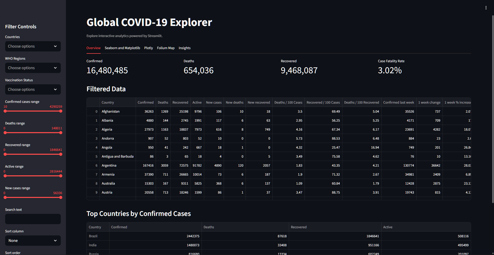
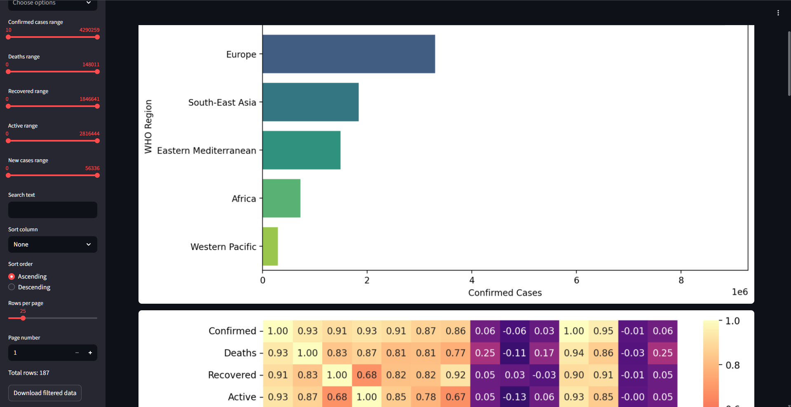
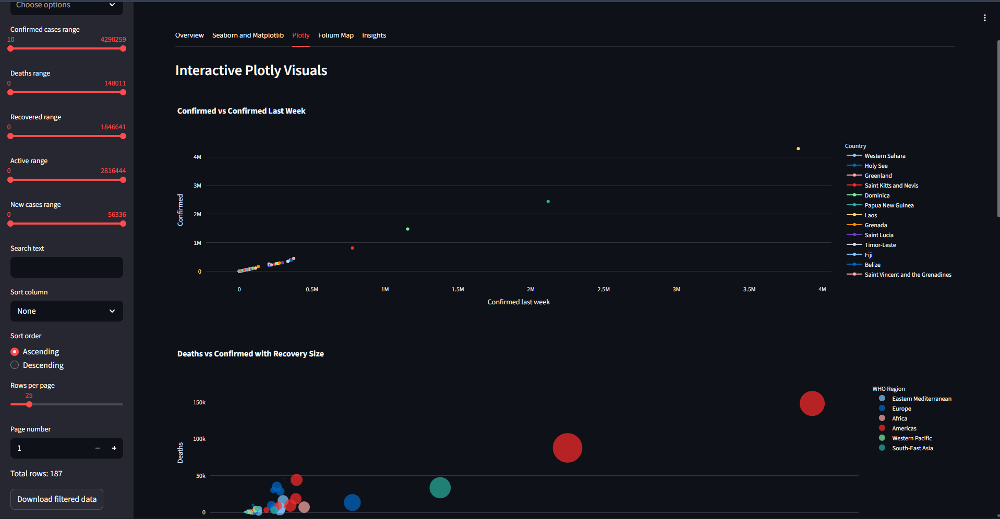
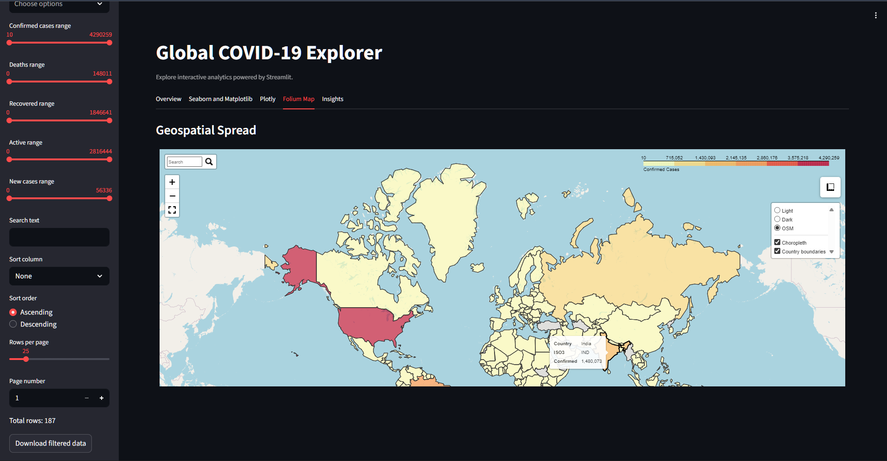
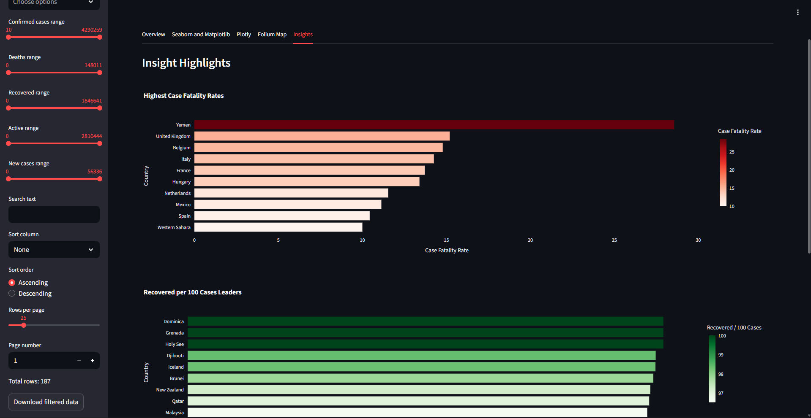

# Global COVID-19 Explorer — Data Visualization Assignment

An interactive data visualization project visualizing a global COVID-19 dataset. The dashboard uses Streamlit for layout and UI, with Seaborn, Matplotlib, Plotly and Folium for charts and mapping.

## Project structure

- `app.py` — Streamlit app; reads `country_wise_latest.csv` and provides filters, plots and an interactive Folium map.
- `country_wise_latest.csv` — Main dataset (country-level COVID-19 metrics).
- `COVID19_Data_Viz_Assignment_01.ipynb` — Notebook with exploratory analysis and writes `app.py` and can be used to run the Streamlit app in Colab using cloudflared.
- `assets/` — Supporting images used in this README and the notebook.
- `collab_preview.pdf` — PDF file consisting preview of jupyter notbook.

## Quick links

- Colab (interactive notebook): https://colab.research.google.com/drive/1eIEiwLE9tYK3zamSqN_xjee_nIBlVY38?usp=sharing
- Streamlit dashboard: https://0xarchit-covid-dashboard.streamlit.app

## Screenshots











## What’s included

- Global overview metrics for Confirmed, Deaths, Recovered and Case Fatality Rate.
- Multiple visualization tabs:
  - Overview: KPI metrics and a paginated, sortable data table of filtered rows.
  - Seaborn & Matplotlib: regional bar charts, correlation heatmap and distribution/box plots.
  - Plotly: interactive line/scatter/treemap/funnel charts for deeper exploration.
  - Folium Map: interactive world choropleth with search, tooltips/popups (Country / ISO3 / Confirmed), multiple basemaps, minimap, fullscreen and measurement tools.
  - Insights: auto-generated highlights (top case fatality rates, recovery leaders, fastest weekly growth).

## How the app works?

- The Streamlit app loads `country_wise_latest.csv` by default (no file upload required).
- Sidebar controls allow filtering by Country, WHO Region, Vaccination Status and numeric ranges for Confirmed / Deaths / Recovered / Active / New cases. Date-range filtering is available if the dataset contains recognized datetime columns.
- Filtered data can be downloaded as CSV.

> Run locally

1. Create a Python environment and install dependencies:

```powershell
pip install streamlit pandas numpy seaborn matplotlib plotly folium pycountry
```


2. From the project root run:

```powershell
streamlit run app.py
```

3. Open the URL shown by Streamlit in your browser.

> Run in Google Colab (Headless Streamlit + cloudflared)

- Open the Colab link above. The provided notebook contains cells to install dependencies, write the `app.py` into the workspace and launch Streamlit with a `cloudflared` tunnel for public access.

## Notes & troubleshooting

- Map rendering requires internet access to fetch the world GeoJSON hosted on GitHub. If your environment blocks outbound requests, the map will show "Map data unavailable." The app also logs the raw error when that happens.
- Country name mismatches are handled via an internal ISO3 mapping table (covers common alternate names). Countries that cannot be mapped to ISO3 will be excluded from the choropleth but remain in the tabular data.
- If your CSV has different column names, the app tries to normalize typical variants (e.g., `Country/Region` → `Country`) but may require manual adjustments.

## Credits

This assignment was implemented using:

- Streamlit for rapid app UI
- Pandas / NumPy for data manipulation
- Seaborn & Matplotlib for static plotting
- Plotly for interactive charts
- Folium for interactive maps

Assets

- All images used in this README are in `assets/` and were created during the exploratory analysis and visualization stages.
